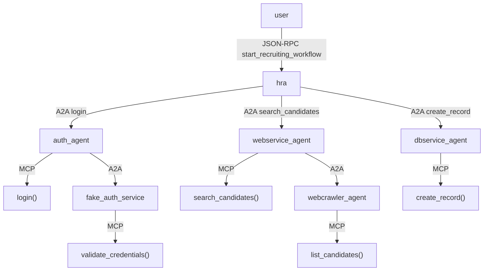

### **Manually connect containers to `agents_net`**

**create the same network as the platform project is created on**

docker network create agents_net

docker-compose down --volumes
docker-compose build hr_recruiting_assistan --no-cache
docker-compose up -d

If you're running `platform_setup_repo` and `hr_recruiting_assistant`  **as separate projects** , do this:

```bash
docker network connect agents_net auth_agent
docker network connect agents_net webservice_agent
docker network connect agents_net dbservice_agent
docker network connect agents_net a2a_registry
```

then run:

docker restart hr_recruiting_assistant

**Confirm Network Membership**

docker network inspect agents_net

**Then test health**

$ docker exec -it hr_recruiting_assistant curl http://auth_agent:8000/health
{"status":"ok","service":"auth_agent"}

# Multi-Agent Platform Setup and LangGraph Orchestration Implementation

## I. Introduction

### A. Overview

This document describes the technical implementation of a foundational multi-agent platform and demonstrates the integration of LangGraph or any agentic framework for sophisticated workflow orchestration within an agent template. It provides complete code artifacts and architectural reference in designing and building distributed AI agent systems. The primary objective is to furnish the necessary components to establish a basic platform (`platform-setup_repo`), refactor an agent template (`mcp-agent_templates`) to leverage LangGraph - or a usecase, and illustrate its usage through a concrete example (`HRRecruitingAssistant-demo`). The focus remains practical, emphasizing executable code and adherence to defined architectural patterns.

### B. Core Architectural Principles: A2A vs. MCP

A fundamental aspect of the architecture presented herein is the deliberate separation between the Agent-to-Agent (A2A) protocol and the Model-Context-Protocol (MCP) pattern (or similar internal capability invocation mechanisms). Understanding this distinction is crucial for building scalable and maintainable multi-agent systems.

* **A2A (Agent-to-Agent):** This protocol governs  *inter-agent communication* . It is designed to facilitate collaboration, task exchange, discovery, and negotiation between independent, potentially opaque AI agents, which might be built using different frameworks or by different teams or orgnization. A2A focuses on the high-level coordination required for agents to work together across system boundaries, defining how they advertise capabilities (via "Agent Cards"), initiate and manage tasks, and exchange information securely. It leverages standard web protocols like HTTP, JSON-RPC, and Server-Sent Events (SSE) to ensure broad interoperability and easier integration into existing enterprise IT stacks.
* **MCP (Model Context Protocol) Pattern:** This pattern addresses  *intra-agent capability invocation* . Its primary goal is to provide tools, context, API functions, or user state dynamically to a *single* agent's reasoning process, often tightly integrated with the underlying Large Language Model (LLM). MCP focuses on enhancing an individual agent's ability to perform actions or access information during its inference or decision-making cycle. While MCP is a specific protocol from Anthropic, the *pattern* of an agent invoking internal tools or functions based on structured inputs/outputs is common. In this document, internal function calls within service agents, using Pydantic models for structure, simulate this pattern.

The adoption of these two distinct approaches is a conscious architectural decision aimed at promoting modularity and a clear separation of concerns. A2A manages the higher-level interactions – the "what" task needs doing and "who" should do it – facilitating collaboration between loosely coupled agents. Conversely, MCP (or the simulated pattern used here) handles the lower-level "how" of executing a specific capability *within* the confines of a single agent. This separation allows agents, such as the `HRRecruitingAssistant`, to interact with services like the `WebServiceAgent` via A2A without needing any knowledge of the `WebServiceAgent`'s internal implementation (e.g., whether it uses an LLM with MCP tools, queries a database directly, or calls another internal service). This decoupling is essential for building scalable systems where agents can be developed, deployed, and updated independently, supporting the "opaque" nature envisioned by the A2A protocol  and fostering diverse technology choices within individual agents.

**Table 1: A2A vs. MCP Pattern Comparison**

| Feature                    | A2A (Agent-to-Agent)                                                            | MCP (Model Context Protocol) Pattern (Simulated)                            |
| :------------------------- | :------------------------------------------------------------------------------ | :-------------------------------------------------------------------------- |
| **Primary Goal**     | Enable inter-agent task exchange, collaboration, and coordination               | Enable an agent to access/invoke internal tools or context during reasoning |
| **Designed For**     | Communication between autonomous, potentially opaque agents                     | Enhancing a single agent's capabilities during inference                    |
| **Focus**            | Multi-agent workflows, discovery, negotiation, task lifecycle management        | Dynamic tool usage, context augmentation, internal function execution       |
| **Execution Model**  | Client agent sends tasks/messages; Remote agent processes and returns artifacts | Agent's internal logic selects and executes defined tools/functions         |
| **Communication**    | Network calls (HTTP/JSON-RPC/SSE) between distinct services/agents              | Internal function calls within a single agent/service process               |
| **Key Concepts**     | Agent Card, Task, Artifact, Message, Part, Client/Remote Roles                  | Tool Definition, Tool Invocation, Structured Input/Output                   |
| **Security Focus**   | Protocol-level (AuthN/AuthZ via Agent Card), Transport Security                 | Handled at the application/agent implementation layer                       |
| **Modality Support** | Modality agnostic (Text, Audio, Video, Forms via Parts)                         | Typically focused on data types supported by the internal tools/functions   |

### C. Orchestration with LangGraph

This implementation introduces LangGraph as the primary mechanism for orchestrating workflows within the `HRRecruitingAssistant-demo` agent and the refactored `mcp-agent_templates`. This represents a shift from potentially simpler, sequential Python function calls to a more robust, graph-based approach. LangGraph is particularly well-suited for defining and executing agentic workflows that often involve complex interactions, state management, conditional logic based on intermediate results, potential cycles (e.g., retries or clarification loops), and structured error handling. Utilizing a graph structure provides better visibility into the flow of execution and state changes, which significantly aids in debugging and maintaining complex multi-step agent interactions. LangGraph allows for the explicit definition of states, nodes representing processing steps, and edges defining transitions, including conditional paths based on the outcome of previous nodes.

## II. Part 1: `platform-setup_repo` File Generation

### A. Overview

The `platform-setup_repo` repository serves as the foundation for the multi-agent system. It contains the definitions and configurations for several standalone services, each acting as a specialized agent. These agents provide basic capabilities (like authentication, simulated web search, simulated database saving) that the primary orchestrator agent (`HRRecruitingAssistant`) will interact with using the A2A protocol. Each service is containerized using Docker for ease of deployment and isolation.

### B. `a2a_registry` Service

This service acts as a minimal placeholder for agent discovery, a critical component in A2A systems. In this simplified setup, it might just hold a static mapping of agent names to URLs.

A genuine A2A discovery mechanism involves agents publishing "Agent Cards" – structured JSON documents describing their capabilities, endpoints, and security requirements. Clients query a registry or a well-known endpoint (`/.well-known/agent.json`) to find suitable agents based on required capabilities. A production-grade implementation would necessitate a robust and scalable registry service. Options within Google Cloud Platform (GCP) include Firestore, a serverless NoSQL document database well-suited for storing JSON-like Agent Cards and enabling event-driven updates , or Cloud SQL, a managed relational database service.

```
HRRecruitingAssistant-demo/
├── app/
│   ├── main.py             # FastAPI app, /recruit endpoint, graph invocation
│   ├── graph.py            # LangGraph definition (State, Nodes, Edges) for HR workflow
│   ├── config.py
│   ├── nodes.py   
│   └── register.py   
├── Dockerfile              # Docker image definition
├── requirements.txt        # Python dependencies
└── run_demo.sh             # Script to run the agent locally (optional)
```

Tracing a request through the `HRRecruitingAssistant`:

1. A POST request hits the `/recruit` endpoint in `app/main.py`.
2. `main.py` initializes the `HRGraphState`.
3. `hr_graph_app.ainvoke` starts the graph execution at the `authenticate` node.
4. The `authenticate_user` function (in `auth_nodes.py`) is called.
5. Inside `authenticate_user`, `a2a_client.discover_agent_url("auth_agent")` is called (this might hit the registry or be simplified).
6. Then, `a2a_client.make_a2a_call` is invoked (`await`ed), sending an A2A request (JSON-RPC over HTTP POST) to the `AuthAgent`'s `/a2a` endpoint.
7. The `AuthAgent` processes the request (calling its internal async `perform_authentication` function - MCP pattern) and sends back an A2A response.
8. `authenticate_user` processes the A2A response and updates the `auth_token` or `auth_error` in the `HRGraphState`.
9. The graph transitions based on `should_proceed_after_auth` to `discover_search_agent`.
10. The `discover_search_agent` node calls `a2a_client.discover_agent_url("webservice_agent")` and updates `search_agent_url` or `discovery_error` in the state.
11. The graph transitions to `invoke_search`.
12. The `invoke_search_agent` node uses the `search_agent_url` and `auth_token` from the state to make another `a2a_client.make_a2a_call` to the `WebServiceAgent`'s `/a2a` endpoint, passing the search query.
13. The `WebServiceAgent` processes the request (calling its internal `perform_web_search` - MCP pattern) and returns candidate data in the A2A response artifacts.
14. `invoke_search_agent` updates the `candidate_list` or `search_error` in the state.
15. The graph transitions based on `should_save_candidates`. If candidates exist, it goes to `discover_save_agent`.
16. `discover_save_agent` finds the `DBServiceAgent` URL via `a2a_client`.
17. The graph transitions to `invoke_save`.
18. `invoke_save_agent` makes an `a2a_client.make_a2a_call` to the `DBServiceAgent`'s `/a2a` endpoint, sending the `candidate_list` in the A2A request artifacts.
19. The `DBServiceAgent` processes the request (calling `perform_data_save` - MCP pattern) and returns the save status in the A2A response.
20. `invoke_save_agent`

# HRRecruitingAssistant-demo

A LangGraph-powered agent that simulates an HR workflow: **login → search candidates → save results**. This assistant is built on top of a multi-agent platform using strict **JSON-RPC 2.0** for inter-agent communication (A2A) and **MCP-style internal tools**.

---

## 🧩 Components

### `HRRecruitingAssistant` (This repo)

- Orchestrates the flow using LangGraph
- Talks to other agents (via A2A) for auth, search, and saving

### 🔗 Dependencies (from `platform_setup_repo`):

- `auth_agent`: validates credentials (uses `fake_auth_service`)
- `webservice_agent`: searches candidates (calls `webcrawler_agent`)
- `webcrawler_agent`: returns mock candidate data
- `dbservice_agent`: stores saved candidates into `candidates.db`
- `a2a_registry`: service registry for discovering other agents

---

## 🧠 Architecture



---

## End-to-End Execution Trace of **HRRecruitingAssistant** `start_recruiting_workflow`

Below is a detailed, step-by-step trace of how a request flows through the **HRRecruitingAssistant** system (built on a LangGraph state machine) when a client invokes the `start_recruiting_workflow` method. This covers the entire lifecycle of the request, from the initial trigger to the final response, including all internal agent communications, registry lookups, and state updates.

### Step-by-Step Details

1. **User Initiates the Workflow:**

   A client (user) sends an HTTP **POST** request to the  **HRRecruitingAssistant** ’s `/a2a` endpoint with a JSON-RPC payload. The payload specifies the method `"start_recruiting_workflow"` (and may include parameters such as user credentials or search criteria). This request reaches the HRRecruitingAssistant’s A2A server interface, which is designed to handle agent-to-agent (A2A) JSON-RPC calls.
2. **Assistant Receives Request & Identifies Method:**

   The HRRecruitingAssistant’s server parses the incoming JSON-RPC request. It recognizes the method `start_recruiting_workflow` and routes this to the corresponding handler – a LangGraph state machine that implements the recruiting workflow. At this point, the system prepares to execute the defined sequence of actions (nodes) for this workflow.
3. **LangGraph State Machine Initialization:**

   The **LangGraph** state machine is initialized for the new request. It starts with an empty or initial state context and loads the predefined graph of nodes/steps that constitute the recruiting workflow. For example, the workflow might consist of nodes for authentication, candidate search, and database update. The state machine transitions from the start node to the first actionable node, ready to handle the first task (such as authenticating the user).
4. **Authentication Phase – Invoking the `auth_agent`:**

   The first step in the workflow is to  **authenticate the user** . The state machine enters an authentication node which needs to verify user credentials before proceeding. The HRRecruitingAssistant now prepares to call an external **Authentication Agent** (`auth_agent`) using the A2A protocol:

   * The assistant contacts the **A2A registry** (a service that maps agent names to their URLs) to resolve the address of `auth_agent`. For example, it might perform a lookup like `get_service_url("auth_agent")`.
   * The `a2a_registry` returns the network endpoint (URL) for the Auth Agent’s service (e.g., an address to the auth_agent’s `/a2a` endpoint).
   * With the URL in hand, the HRRecruitingAssistant issues an HTTP JSON-RPC **POST** request to the `auth_agent`. The request invokes a method (such as `"validate_credentials"` or `"login"`) on the Auth Agent, passing along the user’s credentials (e.g. username and password) obtained from the initial request or a secure store.
5. **Auth Agent Receives Request (Login Attempt):**

   The  **Auth Agent** ’s server receives the JSON-RPC call from HRRecruitingAssistant to authenticate the user. Inside the `auth_agent`, the following occurs:

   * The agent parses the request and extracts the credentials from the params. It recognizes the method (let’s say `"login"`) which is designed to verify user credentials.
   * To actually validate these credentials, `auth_agent` leverages an underlying authentication service. It again uses the `a2a_registry` to find the endpoint for the **Fake Auth Service** (a stubbed auth service in this system). For instance, it looks up `"fake_auth_service"` in the registry.
   * After resolving the address of the Fake Auth Service (e.g., a URL to an API endpoint), the `auth_agent` calls this service. This is typically an HTTP call (could be REST or RPC) to a **login API** of the fake auth service, supplying the user’s username/password for verification.
6. **Fake Auth Service Validates Credentials:**

   The **Fake Auth Service** (a simulated authentication server) receives the login request from `auth_agent`. Internally, this service checks the provided credentials against its data (which might be a hard-coded user for this demo or a simple credential store):

   * If the username and password are valid (match the expected demo credentials), the Fake Auth Service generates a successful response. This usually includes an **authentication token** (e.g., a JWT or session token string) and possibly user details or a success flag. For example, it might return a JSON like `{ "success": true, "token": "XYZ123...", "user_id": "42" }`.
   * If the credentials are invalid, it would instead return an error or a failure status. (In our scenario, we assume valid credentials for the happy path.)
   * The Fake Auth Service sends its response back to the Auth Agent over HTTP.
7. **Auth Agent Processes Auth Response:**

   The `auth_agent` receives the reply from the Fake Auth Service. It now knows whether authentication succeeded and has the token or error message:

   * If  **successful** , the Auth Agent updates its state (if it maintains any) with the user’s authenticated session info (e.g. saves the token and user ID). It prepares a positive JSON-RPC result for the calling assistant.
   * If  **failed** , it would prepare an error result or exception to send back. (For this trace, assume success.)
   * The Auth Agent doesn’t need to do further credential validation itself since the Fake Auth Service has already validated them (the `"validate_credentials"` step essentially happened via the fake service’s login check). It simply trusts that response.
   * Finally, the `auth_agent` formulates a JSON-RPC response to the HRRecruitingAssistant. For example, it might return a result object like `{ "authenticated": true, "token": "XYZ123...", "user_id": 42 }`.
8. **Auth Agent Returns Result to Assistant:**

   The HRRecruitingAssistant’s A2A server (which has been awaiting the auth response) receives the JSON-RPC response from `auth_agent`. This comes via the HTTP response to the request sent in step 4. The assistant now has the outcome of the authentication attempt:

   * The LangGraph state machine updates its state with the authentication result. It might store the `user_id` and `auth_token` in the state context (for use in subsequent calls), and mark the user as authenticated.
   * Since the authentication was successful, the state machine will proceed to the next node in the workflow. (If it had failed, the state machine could transition to an error handling path – e.g., abort the workflow or request new credentials – but those details are outside the happy-path scope here.)
9. **Transition to Candidate Search Phase:**

   With a verified user, the workflow moves on to the **candidate search** step. The state machine transitions from the auth node to the next node designed to find candidate information. At this point, the assistant needs to gather candidate data (for instance, finding potential job candidates based on certain criteria). This is accomplished by calling the **Web Service Agent** (`webservice_agent`), which is responsible for searching candidates via web or internal services.
10. **Invoking Webservice Agent for Search:**

    The HRRecruitingAssistant now prepares an A2A request to the `webservice_agent` to perform a candidate search. It proceeds as follows:

    * The assistant queries the **a2a_registry** for the address of `webservice_agent` (similar to how it did for auth_agent). The registry returns the URL/endpoint where the Web Service Agent is listening for requests.
    * The assistant then sends an HTTP JSON-RPC **POST** to the `webservice_agent`’s endpoint. The request calls a method (for example, `"search_candidates"`) on the Webservice Agent. Included in this request are any search parameters the workflow might specify – for instance, a job title or required skills to look for. (These criteria could be static or provided by the user; for this trace, assume it’s using predefined criteria or none for simplicity.)
    * Optionally, the assistant could also pass along the user’s auth token if the Webservice Agent needs to ensure the request is authorized. (In an internal trusted environment, this might not be necessary, but it could be included as part of context.)
11. **Webservice Agent Delegates to Webcrawler Agent:**

    Upon receiving the `search_candidates` request, the **Webservice Agent** begins processing the candidate search. The Webservice Agent doesn’t have its own database of candidates, so it needs to retrieve data from external sources. It uses a specialized **Webcrawler Agent** to perform web searches or scraping for candidates. Internally, the webservice_agent executes the following sub-steps:

    * It uses the `a2a_registry` to find the `webcrawler_agent`’s service URL (just as the other agents did). This gives it the address of the Webcrawler Agent.
    * The Webservice Agent then sends a JSON-RPC request to the `webcrawler_agent` (via HTTP) invoking a method to search for candidates. It likely calls the same method name (`"search_candidates"`), forwarding the query or criteria it received. For example, it might ask the webcrawler to find CVs or profiles related to “Software Engineer in California” if those were the criteria.
    * The A2A call reaches the Webcrawler Agent, effectively outsourcing the heavy lifting of the search to that agent. The Webservice Agent will wait for the Webcrawler’s response before it can respond back to the main workflow.
12. **Webcrawler Agent Searches External Sources:**

    The **Webcrawler Agent** now handles the request to find candidates. This agent is designed to interact with external websites or data sources (e.g., job boards, social networks) to gather candidate information:

    * The webcrawler_agent receives the search parameters and initiates a web search or scraping task. In a real scenario, this could involve sending queries to search engines, accessing public APIs, or scraping specific websites for resumes or profiles. (In a test scenario, the agent might simply return a prepared list of dummy candidates to simulate this process.)
    * The agent might use internal “tools” or scripts to perform the search (for instance, using a headless browser or an API client). It aggregates the results – say it finds two candidate profiles matching the criteria, each with a name, title, and a link or summary.
    * After gathering the candidate data, the Webcrawler Agent formats the results into a structured response (e.g., an array of candidate objects with details). It then sends a JSON-RPC response back to the caller (Webservice Agent) containing the found candidate information.
13. **Webservice Agent Receives Candidate Data:**

    The `webservice_agent` gets the response from the Webcrawler Agent containing the search results. It now has, for example, a list of candidate profiles that were found externally. The Webservice Agent may perform some processing on this data:

    * It could filter out duplicates or unsuitable entries, normalize data fields, or simply prepare it in the format expected by the HRRecruitingAssistant.
    * If the design calls for combining multiple sources, the Webservice Agent might have also queried an internal database or another service, but in this case we assume all data came from the webcrawler_agent for simplicity.
    * Once ready, the Webservice Agent creates a JSON-RPC response with the candidate search results and sends it back over HTTP to the HRRecruitingAssistant’s A2A endpoint (as the answer to the request made in step 10).
14. **Assistant Updates State with Search Results:**

    The HRRecruitingAssistant’s state machine receives the response from `webservice_agent`. Now it has the candidate data (e.g., a list of candidates). The LangGraph state is updated to include these results – for instance, storing the list in a state variable like `state.candidates_found`.

    * With candidates successfully retrieved, the workflow is ready to proceed to the next step: creating a record for one of these candidates in the internal recruitment database.
    * (If no candidates were found, the workflow might handle that scenario differently – perhaps ending with a message “no candidates found” – but assuming candidates are found, it continues.)
15. **Database Update Phase – Preparing to Call DBService:**

    The final major step in the `start_recruiting_workflow` is to **create a new record** for a candidate in the company’s database (simulating adding the found candidate to the recruiting system). The state machine transitions to the database update node. In preparation:

    * The assistant selects which candidate to add. If multiple candidates were returned, it might choose the top result or iterate through all. For simplicity, assume it picks the first candidate from the search results.
    * The HRRecruitingAssistant will use the **Database Service Agent** (`dbservice_agent`) to perform the record creation. It again needs to find where that service is located, so it will consult the `a2a_registry` for the `dbservice_agent`’s address.
16. **Lookup and Invoke DBService Agent:**

    Using the registry, the assistant obtains the URL for the `dbservice_agent`. It then sends an HTTP JSON-RPC request to that endpoint to invoke the record creation method:

    * The method called might be `"create_record"` (as an example) on the DBService Agent. In the request parameters, the assistant includes the candidate’s information that was gathered (e.g., name, contact info, skills or a summary). This is the data that needs to be stored in the database.
    * The assistant might also include the user’s auth token or user ID in this request, if the database service requires authentication or auditing of who initiated the record creation.
    * This JSON-RPC call is now sent out to the DBService Agent’s A2A interface, instructing it to create a new candidate record in the system.
17. **DBService Agent Processes Record Creation:**

    The **DBService Agent** receives the `create_record` request and begins the process of storing the new candidate data:

    * Internally, the dbservice_agent might interact with an actual database or a simulated one. Since this is a controlled example, it could simply log the data or store it in memory (simulating a database insert) and generate a new record ID. For instance, it might assign an ID like `candidate_id = 101` to this new entry.
    * If this were a real system, the agent would use a database client or ORM to insert a new row into a candidates table with all the provided details, handle any uniqueness checks, etc. Here, assume it succeeds without issues.
    * After “inserting” the record, the DBService Agent prepares a response indicating success. This could include the newly created record’s ID or a success message (e.g., `{ "status": "OK", "record_id": 101 }`). The agent may also update its own internal state or logs that a new record was created.
18. **DBService Agent Returns Response:**

    The DBService Agent sends the result of the create operation back to the HRRecruitingAssistant via the JSON-RPC response. This response travels over HTTP to the assistant. It contains confirmation of the operation’s outcome – typically a success indicator and the new record identifier. For example, the JSON-RPC result might be `{ "record_created": true, "new_record_id": 101 }`. If there had been an error (like a DB failure), an error message or code would be returned instead. In our case, we assume it’s successful.
19. **Finalizing LangGraph State and Outcome:**

    The HRRecruitingAssistant’s state machine receives the database operation result, indicating the candidate’s record was created successfully. It updates the workflow state one last time with this information (e.g., `state.record_id = 101`, and perhaps `state.workflow_status = "completed"`). All planned steps of the LangGraph workflow (auth -> search -> record create) have now been executed. The state machine transitions into a  **final state** , signifying the end of the workflow execution.

    * In the final state, the assistant can compile a summary or final output based on the state. For instance, it might prepare a message like: “Authenticated user X. Found candidate Y. Created record #101 in the database.” This ensures the results of the entire workflow are packaged for the response.
    * The LangGraph runtime then concludes the state machine session for this request, and hands off the final result data to the HRRecruitingAssistant’s A2A service layer to return to the client.
20. **Assistant Sends Final Response to User:**

    With the workflow complete, the HRRecruitingAssistant sends back an HTTP response to the original client’s POST request. This final response follows the JSON-RPC format and contains the outcome of the `start_recruiting_workflow` method call. For example, the JSON might look like:

    ```json
    {
      "jsonrpc": "2.0",
      "id": 1, 
      "result": {
         "success": true,
         "message": "Recruiting workflow completed.",
         "new_candidate_record_id": 101,
         "candidate_name": "Jane Doe"
      }
    }

    ```

    This tells the user (or calling application) that the workflow succeeded, and provides relevant data (such as the name of the candidate added and the new record ID). The client receives this data, concluding the full round-trip execution.

Each step above illustrates how the HRRecruitingAssistant orchestrates multiple agents and services (auth, web search, database) using LangGraph. We saw how it triggers the state machine, calls out to other agents via the A2A protocol, how each agent performs its internal duties (resolving addresses with the registry and invoking necessary tools like login, search, etc.), and how results propagate back. Finally, the assistant aggregates the outcomes and returns a coherent response to the user, completing the **start_recruiting_workflow** successfully.

## 🔧 How A2A and MCP Help

### A2A (Agent-to-Agent Protocol)

- Standard JSON-RPC 2.0 over HTTP
- Enables agents to remain loosely coupled
- `auth_agent`, `webservice_agent`, `dbservice_agent` all use this protocol

### MCP (Model Context Protocol)

- Each agent handles its logic internally via structured tools (Python functions)
- Encapsulates business logic behind RPC endpoints
- e.g. `auth_agent` calls `login()`, `dbservice_agent` calls `create_record()` internally

---

## 🚀 Run Locally

### 1. Make sure `platform_setup_repo` is up and running:

```bash
docker-compose up --build
```

### 2. Build and run this agent:

```bash
docker build -t hr_recruiting_assistant .
docker run -p 8005:8005 --network=agents_net hr_recruiting_assistant
```

### 3. (Optional) Register agent with registry

```bash
python register.py
```

---

## 🔍 Test with Swagger

Visit:

```
http://localhost:8005/docs
```

Try:

- `/run_workflow` → Fill in:
  - username: `admin`
  - password: `secret`
  - title: `Data Scientist`
  - skills: `Python,Machine Learning`

Expected: Candidates saved and printed

---

## 📖 What You’ll See in Logs

docker-compose logs -f hr_recruiting_assistant

- `Authenticating user...`
- `Searching for candidates...`
- `Saving candidates...`

These show A2A calls firing, and MCP logic executing within each agent.

---

# Why not just use REST APIs?

We **could** use REST for everything, but JSON-RPC provides key architectural benefits:

---

### Benefits of using JSON-RPC 2.0 for A2A/MCP

* **Single Endpoint Pattern**

  We expose a single `/a2a` route, and dispatch based on `"method"` field.

  Simple routing logic
  Easier to secure, log, rate-limit
  Better suited for plugin/agent architecture (e.g., dynamic method discovery)
* **Structured Interface for Orchestration**

  * The **method metadata** from the registry (e.g., `get_method_details`) allows a UI to **auto-generate** forms or workflows.
  * You can **describe and call** agents dynamically, like a GraphQL registry.
* **Consistent Agent Protocol**

  * All agents can follow the same contract (versioned, typed, introspectable).
  * Interoperability between Python, JavaScript, or Go-based agents becomes easier.
  * Especially useful when **LangGraph** or another orchestrator is calling them dynamically.
* **Better than REST for internal calls**

  * REST has semantic overhead (GET/POST/PUT/PATCH + routing).
  * JSON-RPC just says: `"method": "foo", "params": {...}` — it's simpler and versioned.

# ✅ Summary

This demo shows how:

- A developer can use `mcp-agent-templates` to bootstrap an agent
- A LangGraph orchestrator automates multi-step HR workflows
- A2A + MCP = clean separation of responsibilities + reusability
