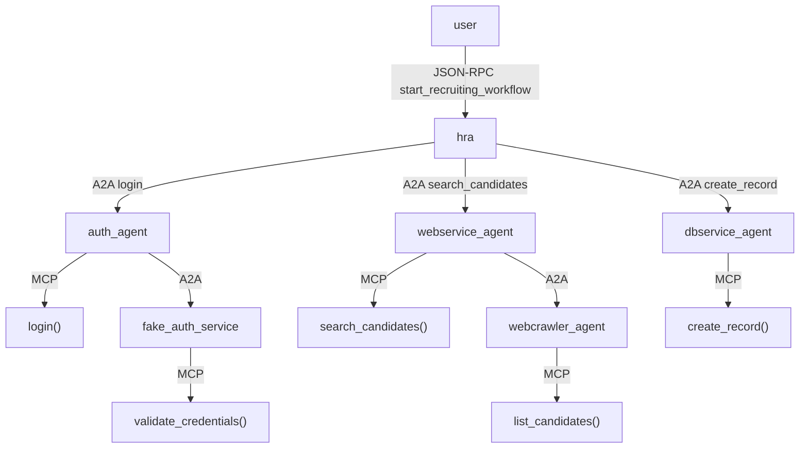

### **Manually connect containers to `agents_net`**

**create the same network as the platform project is created on** 

docker network create agents_net


If you're running `platform_setup_repo` and `hr_recruiting_assistant`  **as separate projects** , do this:

```bash
docker network connect agents_net auth_agent
docker network connect agents_net webservice_agent
docker network connect agents_net dbservice_agent
docker network connect agents_net a2a_registry
```

then run: 

docker restart hr_recruiting_assistant

**Confirm Network Membership**

docker network inspect agents_net

**Then test health**

$ docker exec -it hr_recruiting_assistant curl http://auth_agent:8000/health
{"status":"ok","service":"auth_agent"}

# Multi-Agent Platform Setup and LangGraph Orchestration Implementation

## I. Introduction

### A. Overview

This report details the technical implementation of a foundational multi-agent platform and demonstrates the integration of LangGraph for sophisticated workflow orchestration within an agent template. It provides complete code artifacts and architectural guidance intended for senior software engineers and technical leads involved in designing and building distributed AI agent systems. The primary objective is to furnish the necessary components to establish a basic platform (`platform-setup_repo`), refactor an agent template (`mcp-agent_templates`) to leverage LangGraph, and illustrate its usage through a concrete example (`HRRecruitingAssistant-demo`). The focus remains practical, emphasizing executable code and adherence to defined architectural patterns.

### B. Core Architectural Principles: A2A vs. MCP

A fundamental aspect of the architecture presented herein is the deliberate separation between the Agent-to-Agent (A2A) protocol and the Model-Context-Protocol (MCP) pattern (or similar internal capability invocation mechanisms). Understanding this distinction is crucial for building scalable and maintainable multi-agent systems.

* **A2A (Agent-to-Agent):** This protocol governs  *inter-agent communication* . It is designed to facilitate collaboration, task exchange, discovery, and negotiation between independent, potentially opaque AI agents, which might be built using different frameworks or by different vendors.^^ A2A focuses on the high-level coordination required for agents to work together across system boundaries, defining how they advertise capabilities (via "Agent Cards"), initiate and manage tasks, and exchange information securely.^^ It leverages standard web protocols like HTTP, JSON-RPC, and Server-Sent Events (SSE) to ensure broad interoperability and easier integration into existing enterprise IT stacks.^^
* **MCP (Model Context Protocol) Pattern:** This pattern addresses  *intra-agent capability invocation* . Its primary goal is to provide tools, context, API functions, or user state dynamically to a *single* agent's reasoning process, often tightly integrated with the underlying Large Language Model (LLM).^^ MCP focuses on enhancing an individual agent's ability to perform actions or access information during its inference or decision-making cycle.^^ While MCP is a specific protocol from Anthropic, the *pattern* of an agent invoking internal tools or functions based on structured inputs/outputs is common. In this report, internal function calls within service agents, using Pydantic models for structure, simulate this pattern.**   **

The adoption of these two distinct approaches is a conscious architectural decision aimed at promoting modularity and a clear separation of concerns. A2A manages the higher-level interactions – the "what" task needs doing and "who" should do it – facilitating collaboration between loosely coupled agents. Conversely, MCP (or the simulated pattern used here) handles the lower-level "how" of executing a specific capability *within* the confines of a single agent. This separation allows agents, such as the `HRRecruitingAssistant`, to interact with services like the `WebServiceAgent` via A2A without needing any knowledge of the `WebServiceAgent`'s internal implementation (e.g., whether it uses an LLM with MCP tools, queries a database directly, or calls another internal service). This decoupling is essential for building scalable systems where agents can be developed, deployed, and updated independently, supporting the "opaque" nature envisioned by the A2A protocol  and fostering diverse technology choices within individual agents.

**Table 1: A2A vs. MCP Pattern Comparison**

| Feature                    | A2A (Agent-to-Agent)                                                            | MCP (Model Context Protocol) Pattern (Simulated)                            |
| :------------------------- | :------------------------------------------------------------------------------ | :-------------------------------------------------------------------------- |
| **Primary Goal**     | Enable inter-agent task exchange, collaboration, and coordination               | Enable an agent to access/invoke internal tools or context during reasoning |
| **Designed For**     | Communication between autonomous, potentially opaque agents                     | Enhancing a single agent's capabilities during inference                    |
| **Focus**            | Multi-agent workflows, discovery, negotiation, task lifecycle management        | Dynamic tool usage, context augmentation, internal function execution       |
| **Execution Model**  | Client agent sends tasks/messages; Remote agent processes and returns artifacts | Agent's internal logic selects and executes defined tools/functions         |
| **Communication**    | Network calls (HTTP/JSON-RPC/SSE) between distinct services/agents              | Internal function calls within a single agent/service process               |
| **Key Concepts**     | Agent Card, Task, Artifact, Message, Part, Client/Remote Roles                  | Tool Definition, Tool Invocation, Structured Input/Output                   |
| **Security Focus**   | Protocol-level (AuthN/AuthZ via Agent Card), Transport Security                 | Handled at the application/agent implementation layer                       |
| **Modality Support** | Modality agnostic (Text, Audio, Video, Forms via Parts)                         | Typically focused on data types supported by the internal tools/functions   |

### C. Orchestration with LangGraph

This implementation introduces LangGraph as the primary mechanism for orchestrating workflows within the `HRRecruitingAssistant-demo` agent and the refactored `mcp-agent_templates`. This represents a shift from potentially simpler, sequential Python function calls to a more robust, graph-based approach. LangGraph is particularly well-suited for defining and executing agentic workflows that often involve complex interactions, state management, conditional logic based on intermediate results, potential cycles (e.g., retries or clarification loops), and structured error handling. Utilizing a graph structure provides better visibility into the flow of execution and state changes, which significantly aids in debugging and maintaining complex multi-step agent interactions.^^ LangGraph allows for the explicit definition of states, nodes representing processing steps, and edges defining transitions, including conditional paths based on the outcome of previous nodes.**   **

## II. Part 1: `platform-setup_repo` File Generation

### A. Overview

The `platform-setup_repo` repository serves as the foundation for the multi-agent system. It contains the definitions and configurations for several standalone services, each acting as a specialized agent. These agents provide basic capabilities (like authentication, simulated web search, simulated database saving) that the primary orchestrator agent (`HRRecruitingAssistant`) will interact with using the A2A protocol. Each service is containerized using Docker for ease of deployment and isolation.

### B. `a2a_registry` Service

This service acts as a minimal placeholder for agent discovery, a critical component in A2A systems.^^ In this simplified setup, it might just hold a static mapping of agent names to URLs.**   **

A genuine A2A discovery mechanism involves agents publishing "Agent Cards" – structured JSON documents describing their capabilities, endpoints, and security requirements.^^ Clients query a registry or a well-known endpoint (`/.well-known/agent.json`) to find suitable agents based on required capabilities.^^ A production-grade implementation would necessitate a robust and scalable registry service. Options within Google Cloud Platform (GCP) include Firestore, a serverless NoSQL document database well-suited for storing JSON-like Agent Cards and enabling event-driven updates ^^, or Cloud SQL, a managed relational database service.^^ The provided files represent the simplest possible stub to fulfill the discovery role for the demo.**   **

```
HRRecruitingAssistant-demo/
├── app/
│   ├── main.py             # FastAPI app, /recruit endpoint, graph invocation
│   ├── graph.py            # LangGraph definition (State, Nodes, Edges) for HR workflow
│   ├── config.py
│   ├── nodes.py   
│   └── register.py     
├── Dockerfile              # Docker image definition
├── requirements.txt        # Python dependencies
└── run_demo.sh             # Script to run the agent locally (optional)
```

Tracing a request through the `HRRecruitingAssistant`:

1. A POST request hits the `/recruit` endpoint in `app/main.py`.
2. `main.py` initializes the `HRGraphState`.
3. `hr_graph_app.ainvoke` starts the graph execution at the `authenticate` node.
4. The `authenticate_user` function (in `auth_nodes.py`) is called.
5. Inside `authenticate_user`, `a2a_client.discover_agent_url("auth_agent")` is called (this might hit the registry or be simplified).
6. Then, `a2a_client.make_a2a_call` is invoked (`await`ed), sending an A2A request (JSON-RPC over HTTP POST) to the `AuthAgent`'s `/a2a` endpoint.
7. The `AuthAgent` processes the request (calling its internal async `perform_authentication` function - MCP pattern) and sends back an A2A response.
8. `authenticate_user` processes the A2A response and updates the `auth_token` or `auth_error` in the `HRGraphState`.
9. The graph transitions based on `should_proceed_after_auth` to `discover_search_agent`.
10. The `discover_search_agent` node calls `a2a_client.discover_agent_url("webservice_agent")` and updates `search_agent_url` or `discovery_error` in the state.
11. The graph transitions to `invoke_search`.
12. The `invoke_search_agent` node uses the `search_agent_url` and `auth_token` from the state to make another `a2a_client.make_a2a_call` to the `WebServiceAgent`'s `/a2a` endpoint, passing the search query.
13. The `WebServiceAgent` processes the request (calling its internal `perform_web_search` - MCP pattern) and returns candidate data in the A2A response artifacts.
14. `invoke_search_agent` updates the `candidate_list` or `search_error` in the state.
15. The graph transitions based on `should_save_candidates`. If candidates exist, it goes to `discover_save_agent`.
16. `discover_save_agent` finds the `DBServiceAgent` URL via `a2a_client`.
17. The graph transitions to `invoke_save`.
18. `invoke_save_agent` makes an `a2a_client.make_a2a_call` to the `DBServiceAgent`'s `/a2a` endpoint, sending the `candidate_list` in the A2A request artifacts.
19. The `DBServiceAgent` processes the request (calling `perform_data_save` - MCP pattern) and returns the save status in the A2A response.
20. `invoke_save_agent`


# HRRecruitingAssistant-demo

A LangGraph-powered agent that simulates an HR workflow: **login → search candidates → save results**. This assistant is built on top of a multi-agent platform using strict **JSON-RPC 2.0** for inter-agent communication (A2A) and **MCP-style internal tools**.

---

## 🧩 Components

### `HRRecruitingAssistant` (This repo)

- Orchestrates the flow using LangGraph
- Talks to other agents (via A2A) for auth, search, and saving

### 🔗 Dependencies (from `platform_setup_repo`):

- `auth_agent`: validates credentials (uses `fake_auth_service`)
- `webservice_agent`: searches candidates (calls `webcrawler_agent`)
- `webcrawler_agent`: returns mock candidate data
- `dbservice_agent`: stores saved candidates into `candidates.db`
- `a2a_registry`: service registry for discovering other agents

---

## 🧠 Architecture



---

## 🔧 How A2A and MCP Help

### A2A (Agent-to-Agent Protocol)

- Standard JSON-RPC 2.0 over HTTP
- Enables agents to remain loosely coupled
- `auth_agent`, `webservice_agent`, `dbservice_agent` all use this protocol

### MCP (Model Context Protocol)

- Each agent handles its logic internally via structured tools (Python functions)
- Encapsulates business logic behind RPC endpoints
- e.g. `auth_agent` calls `login()`, `dbservice_agent` calls `create_record()` internally

---

## 🚀 Run Locally

### 1. Make sure `platform_setup_repo` is up and running:

```bash
docker-compose up --build
```

### 2. Build and run this agent:

```bash
docker build -t hr_recruiting_assistant .
docker run -p 8005:8005 --network=agents_net hr_recruiting_assistant
```

### 3. (Optional) Register agent with registry

```bash
python register.py
```

---

## 🔍 Test with Swagger

Visit:

```
http://localhost:8005/docs
```

Try:

- `/run_workflow` → Fill in:
  - username: `admin`
  - password: `secret`
  - title: `Data Scientist`
  - skills: `Python,Machine Learning`

Expected: Candidates saved and printed

---

## 📖 What You’ll See in Logs

docker-compose logs -f hr_recruiting_assistant

- `Authenticating user...`
- `Searching for candidates...`
- `Saving candidates...`

These show A2A calls firing, and MCP logic executing within each agent.

---

## ✅ Summary

This demo shows how:

- A developer can use `mcp-agent-templates` to bootstrap an agent
- A LangGraph orchestrator automates multi-step HR workflows
- A2A + MCP = clean separation of responsibilities + reusability

Great for enterprise use cases involving AI agents, automation, or intelligent assistants.
